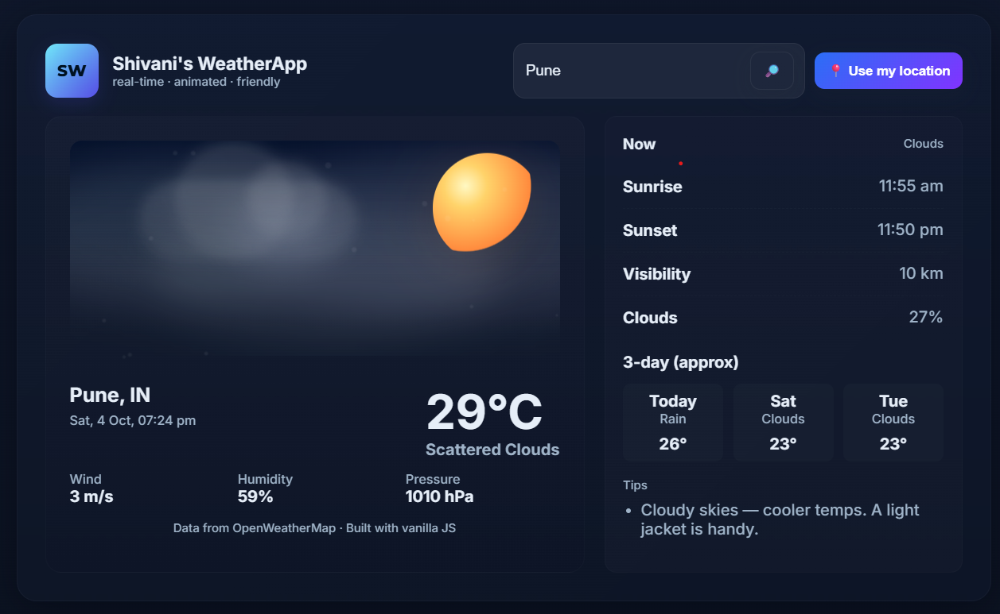

# 🌀 WeatherApp 🌦️

A beautiful and animated weather application built with HTML, CSS, and JavaScript, powered by the OpenWeather API.
It displays real-time temperature, weather conditions, and city information — all wrapped in a modern, floating-glass design.

A beautiful and animated weather app built using HTML, CSS, and JavaScript.

🚀 Features

🌍 Real-time weather data using the OpenWeather API

🎨 Smooth animations and a modern glass-effect UI

📱 Responsive layout for all devices

⚡ Built with pure HTML, CSS, and JavaScript — no frameworks needed

🌈 Dynamic background colors based on weather condition

🧩 Tech Stack

HTML5

CSS3

JavaScript (ES6)

OpenWeather API

⚙️ How to Use

Clone or download this repository

Open index.html in your browser

Type any city name and get instant weather details 🌦️

🔑 API Setup

Create a free account at OpenWeatherMap

Generate your API key from your dashboard

In your index.html (inside <script>), replace this line with your own key:

const OPENWEATHER_KEY = "YOUR_API_KEY_HERE";

🌍 Deployment

This project is live on GitHub Pages ✨
🔗 Visit WeatherApp

Include animated icons for rain, snow, etc.

Store last searched city using LocalStorage
